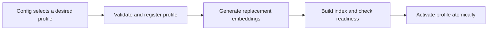

# Adisu backend architecture and setup review

Completed 25 September 2026, commit `216fc0a94ea86bcd712028c2647b36f2e11e0c77`, branch `dev`.

[Open the HTML presentation](/home/johna/Projects/adisu/backend/backend-review/presentation.html) for diagrams, all 23 topic summaries, and an interactive model-switching walkthrough.

## Assessment

Keep the Go modular monolith and the separate Python AI service. Go owns the product's transactional operations; Python owns model execution, retrieval, and ingestion. Running the Python API and ingestion worker as separate processes is appropriate for their different workloads.

The domain grouping is useful, and several foundations are already present: generated API contracts, explicit dependency injection, database migrations, storage adapters, an ingestion outbox, event signatures, and an ingestion ledger. The main weaknesses are module boundaries, transaction ownership, connection lifetimes, and failure handling. Several affect correctness today, before traffic or team size becomes large.

I would fix the defects below before doing a broad directory reorganization. A folder rename will not fix a shared database session, a lost event, or a migration command that starts the wrong executable.

This is a review of the checked-in implementation and deployment configuration. I did not inspect a running production deployment or external proxy configuration. Deployment findings describe what these files produce. No tracked source files were changed.

## What I inspected and verified

The inventory contains 562 non-generated Go files across 124 packages, including 23 test files. Python has 183 source files excluding generated stubs, including 51 test files. Counts include tests and are not coverage measurements.

I traced the composition roots, module imports, representative handlers and use cases, repository implementations, both database setups, migrations, HTTP and gRPC wiring, event publishing and consumption, storage, WebSockets, configuration, Docker files, and CI workflows.

| Check | Result and limits |
| --- | --- |
| Existing Go suite | `go test ./...` passed. Installed Go was 1.27.1; the project and CI specify Go 1.25.3. This does not replace the pinned CI run. |
| WebSocket replacement probe | Confirmed that cleanup from an older connection removes its replacement and leaves the old subscription. Exercised the actual hub bookkeeping through a Go test overlay. |
| Repository failure probe | Confirmed that injected GORM query failures become an empty page with no error return. No live database was needed. |
| Python streaming auth probe | Executed the source helper with a fake handler. An unauthorized streaming handler was returned unchanged. This was not a wire-level gRPC test. |
| Python retry probe | Executed the consumer's source methods with fake deliveries. Six failures with `max_retries=3` all requested requeue; the retry count remained zero. No live RabbitMQ was used. |
| Python suite | 434 tests passed, 83.75% coverage, using Python 3.11.9 and the frozen lockfile. Ran against an isolated snapshot with generated protobuf stubs. The configured coverage gate passed. |
| Python static checks | Ruff and Bandit passed. BasedPyright passed with zero errors or warnings after explicitly configuring the isolated virtual environment. The first type-check invocation did not resolve that environment and is not counted as a repository failure. |
| Deployment and schema changes | Static review only. I did not run production migrations, call model providers, or start the full deployment. |

The [inventory script](/tmp/adisu-backend-review/inventory.py), [Go probes](/tmp/adisu-backend-review/go-probes.log), [Python probe script](/tmp/adisu-backend-review/python_source_probes.py), [Go test log](/tmp/adisu-backend-review/go-test.log), [Python test log](/tmp/adisu-backend-review/python-test.log), and [type-check log](/tmp/adisu-backend-review/python-typecheck-configured.log) are available with this report. Review probes are stored in `/tmp/adisu-backend-review`, outside the application test suites. See the [verification notes](/home/johna/Projects/adisu/backend/backend-review/verification.md) for commands and environment details.

## Fix order

P1 means I would fix it before trusting the affected feature in production. P2 means a correctness, operability, or maintenance issue to address next. These are review priorities, not claims about an incident in production.

| Priority | Finding | Consequence |
| --- | --- | --- |
| P1 | Python database sessions live with the server's use cases; quota writes only flush | Concurrent RPCs share session state, and quota changes lack a commit owner. |
| P1 | Python token authentication passes streaming handlers through; Go gRPC has no authentication interceptor | A caller with network access can reach operations without the intended service authentication. |
| P1 | Python retry attempts do not survive requeue | Poison messages can cycle indefinitely despite the configured retry limit. |
| P1 | Outbox publication lacks broker confirmation; AI completion precedes database commit | Accepted work or terminal status can disappear, or report completion before persistence succeeds. |
| P1 | Go migration container retains the API entrypoint; migration CLI boots the whole application | The migration job starts the wrong executable, and the CLI has unrelated runtime dependencies. |
| P1 | Production Compose omits the Go ingestion signing secret | Configuring the intended Python secret causes Go and Python to use different signing keys. |
| P1 for private/direct uploads | SeaweedFS upload and download URLs do not implement the promised expiring authorization | The adapter reports an expiry without enforcing it. External access controls determine the exposure. |
| P2 | WebSocket unregister uses account identity rather than connection identity | Reconnection can disconnect the new connection and retain stale subscriptions. |
| P2 | Generic repository hides query errors | API callers cannot distinguish database failure from an empty result. |
| P2 | Embedding dimensions and migration history disagree with selectable providers | Changing the provider can break inserts or mix incompatible retrieval data. |
| P2 | CI installs golangci-lint v1 against a v2 configuration | The lint configuration and executable are incompatible. |

## Go service

### 1. The module layout is reasonable, but boundaries are weak

`cmd/api`, `internal/bootstrap`, and domain-oriented modules are a sensible layout for a Go server. The tiny [API entrypoint](/home/johna/Projects/adisu/backend/core-backend/cmd/api/main.go:5) and [composition root](/home/johna/Projects/adisu/backend/core-backend/internal/bootstrap/app.go:13) are good choices. Go's own guidance recommends keeping server implementation packages under `internal`. [Go module layout guidance](https://go.dev/doc/modules/layout)

The important distinction is what other modules can import. Currently, modules can reach into one another's domain repositories, entities, application services, and delivery context keys. For example, [guide use cases](/home/johna/Projects/adisu/backend/core-backend/internal/modules/guide/application/usecase/guide_view_usecase.go:17) depend on IAM repositories and notification persistence concepts. That makes a notification schema change a potential guide-module change.

The inventory shows these dependencies at the module level:

| Module | Other modules imported | Test files inside the module |
| --- | --- | --- |
| IAM | AI tool, notification | 2 |
| Notification | AI tool, IAM | 0 |
| Guide | AI tool, IAM, notification | 0 |
| Community | IAM | 1 |
| Library | AI tool, IAM | 0 |
| Payment | IAM, notification | 1 |
| AI | IAM | 12 |
| Core gRPC | AI, AI tool, IAM | 0 |

This is an import inventory, including test imports. The reciprocal IAM/notification relationship is an architectural coupling; it is not an illegal Go package import cycle.

Give each business module a small supported interface, such as account lookup, subscription lookup, or notification submission. Other modules should call these operations without receiving another module's GORM repository. Keep the database shared if that suits the application. Define table ownership separately from database ownership.

There is a useful precedent in [modules.go](/home/johna/Projects/adisu/backend/core-backend/internal/modules/modules.go:35): notification receives IAM and payment reader adapters through narrow interfaces. Extend that pattern. Replace required default stubs with required dependencies so a missing adapter fails startup. A stub that assumes notifications are enabled or returns a free subscription can otherwise produce plausible but wrong behavior.

For enforcement, introduce an import rule for module internals, or use nested `internal` directories where practical. The top-level `internal` directory prevents outside repositories from importing packages; it does not stop your own modules importing each other's internals.

### 2. `internal/core` owns too many unrelated concerns

[core.Module](/home/johna/Projects/adisu/backend/core-backend/internal/core/module.go:1) gathers configuration, logging, database setup, migrations, HTTP, schema registration, cache, email, messaging, and provider setup. Because almost every module imports `core`, it becomes difficult to see which capability a constructor actually needs.

There is also a dependency back into a business module: core wires [shared event subscribers](/home/johna/Projects/adisu/backend/core-backend/internal/events/subscribers.go:8), and those subscribers import IAM events. Shared middleware also depends on IAM application types. This makes the foundation depend on product behavior.

Split responsibilities as you next change them:

- Keep `bootstrap` responsible for assembling the application and owning its lifecycle.
- Put database connection setup, logging, HTTP server setup, messaging, and storage in cohesive internal packages.
- Keep IAM-specific event handling and authorization policy with IAM or with an explicit integration package.
- Keep schema enumeration separate from starting the HTTP application.

The goal is a constructor that asks for its real dependencies. It should not need a broad foundation package merely to obtain one logger type.

### 3. `pkg`, `shared`, and interfaces need a narrower purpose

`pkg` is a convention, not an access restriction. A provider client such as `pkg/chapa` can reasonably be independent. An error middleware that imports IAM context keys is application code and belongs under `internal`.

`shared` currently mixes small reusable values with persistence frameworks, authorization middleware, and business event contracts. Keep shared code small and name packages after what they do. A business contract should have an owner, even when many modules consume it. Go's package naming guidance specifically discourages vague packages that accumulate unrelated code. [Go package names](https://go.dev/blog/package-names)

The [generic repository interface](/home/johna/Projects/adisu/backend/core-backend/internal/shared/repository/generic_repository.go:12) exposes a large CRUD contract and `GetDB() *gorm.DB`. Domain repositories embed it. This leaks GORM and gives every consumer operations it may not need.

Use small interfaces owned by consumers, such as `FindAccount`, `ReserveQuota`, or `ListPublishedGuides`. Keep generic CRUD helpers inside the adapter if they reduce repetition. They need not become the public contract for every aggregate. Go's review guidance recommends defining interfaces in the package that consumes them. [Go code review comments](https://go.dev/wiki/CodeReviewComments)

Not every concrete service needs an interface. An interface is useful when it expresses a meaningful dependency or enables a realistic replacement. Repeating every method of a single implementation across an interface and a forwarding layer adds navigation without improving the boundary.

### 4. Structs are mostly practical, with avoidable invalid states

Keeping Huma request/response structs separate from persistence entities is the right choice. Keep validation at the HTTP boundary, and keep generated transport types tied to the generated OpenAPI contract.

Your entities use GORM tags and shared persistence types. That is a pragmatic approach for CRUD-heavy modules. It does mean the current `domain` directory is partly a persistence model. You do not need to manufacture a second entity model for every table. Add separation where an aggregate has substantial invariants or a database representation obscures the business operation.

The [shared BaseModel](/home/johna/Projects/adisu/backend/core-backend/internal/shared/model/base_model.go:10) uses pointers for non-null creation and update timestamps and a pointer to `gorm.DeletedAt`. Prefer `time.Time` for required timestamps and the usual value form of `gorm.DeletedAt`. Use pointers when absence has a real meaning. Required database values should not force every caller to reason about nil.

There is a separate older base model in [core/database.go](/home/johna/Projects/adisu/backend/core-backend/internal/core/database.go:18), including a tenant field and empty hook, and two UUID-array implementations under `shared/model` and `shared/dbtypes`. Consolidate these after checking callers. The UUID-array variants differ on SQL NULL versus an empty array, so choose the intended semantics before deleting one.

Large files such as the guide DTO file or IAM authentication service are not defects by line count. Split them around coherent operations when unrelated changes repeatedly collide. Splitting them into many one-function files would not solve ownership problems.

### 5. Repository errors must reach callers

[BaseRepository.findAll](/home/johna/Projects/adisu/backend/core-backend/internal/shared/repository/base_repository.go:151) logs a query error and returns an empty page. The count query also ignores its error. Its return type has no error channel.

The review probe replaced GORM's query callback with a failing callback. Both queries failed, while the caller received an empty page. This can turn a database outage into a successful response containing no records.

Change list operations to return a page and an error, and propagate both count and fetch errors. Test the HTTP result for a repository failure so the error cannot disappear again in the next layer.

The existing transaction helper is useful. Ensure all repositories participating in a command use the same transaction. Since [database setup](/home/johna/Projects/adisu/backend/core-backend/internal/core/database.go:53) disables GORM's default transactions, audit commands that perform multiple writes for an explicit transaction owner. Test rollback of the whole business operation, including outbox insertion.

### 6. Bootstrapping needs clear start and stop ownership

Fx is a reasonable choice here. Each long-lived resource should have one owner that constructs it, starts it, reports failure, and stops it.

There are specific lifecycle gaps:

- [HTTP startup](/home/johna/Projects/adisu/backend/core-backend/internal/core/server.go:49) starts `ListenAndServe` in a goroutine and returns success before the port is bound. A bind failure is logged after startup has succeeded. Bind a listener synchronously, then run `Serve`; terminate the application on an unexpected server failure.
- The [community cleanup worker](/home/johna/Projects/adisu/backend/core-backend/internal/modules/community/module.go:192) starts through an invoke with a background context. It needs a lifecycle-owned cancellation signal and a completion wait.
- Workers that receive cancellation should finish before their database and broker connections close. Cancellation alone does not establish that ordering.
- [Go gRPC shutdown](/home/johna/Projects/adisu/backend/core-backend/internal/modules/coregrpc/module.go:62) calls `GracefulStop` without honoring the Fx stop context. Use a bounded grace period with a forced stop fallback.
- The [inference client constructor](/home/johna/Projects/adisu/backend/core-backend/internal/modules/ai/infrastructure/client/grpc_client.go:38) creates a connection without an evident lifecycle owner to close it.
- Explicitly close and drain WebSockets. HTTP server shutdown does not close upgraded connections. [Go HTTP shutdown documentation](https://pkg.go.dev/net/http#Server.Shutdown)

These changes also make focused module tests and command-line tools easier to construct.

### 7. Migration setup has two independent defects

The Go image declares [ENTRYPOINT `/app/app`](/home/johna/Projects/adisu/backend/core-backend/Dockerfile:40). The production [migration service](/home/johna/Projects/adisu/backend/docker-compose.prod.yml:245) supplies `command: /app/schema -action=apply` without overriding that entrypoint. The effective invocation starts `/app/app` with the schema command as arguments. The API main function does not dispatch those arguments. Compose `command` overrides the image command, not its entrypoint. [Docker Compose command reference](https://docs.docker.com/reference/compose-file/services/#command)

Fix the entrypoint or use an image entrypoint that deliberately dispatches the requested executable. The development migration service has the same pattern.

Even with that fixed, [cmd/schema](/home/johna/Projects/adisu/backend/core-backend/cmd/schema/main.go:20) constructs `core.Module` and every application module, then calls `app.Start` before applying migrations. This starts application hooks, listeners, and seeders before the schema operation. A migration command should need database configuration and schema metadata, not a running API and every external adapter.

The API also [applies migrations on startup](/home/johna/Projects/adisu/backend/core-backend/internal/core/module.go:101) unless the skip flag is set. Pick an explicit production owner, preferably a release job that completes before application rollout. Do not depend on both paths accidentally agreeing.

Other improvements:

- Make Atlas subprocesses respect a context and deadline.
- Fix the module filter. `GenerateMigration` selects entities, but [LoadGORMSchema](/home/johna/Projects/adisu/backend/core-backend/internal/core/schema.go:101) rebuilds the complete entity set.
- Test an empty database and an upgrade from a populated previous schema. A generated migration file alone does not prove the upgrade works.
- Pin the migration tool version so local generation, CI, and the image use the same implementation.

### 8. Huma and generated contracts are a strength

The DTO-driven OpenAPI approach fits this project. Reusing module route registration for [spec generation](/home/johna/Projects/adisu/backend/core-backend/cmd/spec/main.go:1) is better than maintaining a separate specification by hand.

The remaining risk is drift in composition: the spec command maintains its own module list and API configuration. Make the route catalog reusable without constructing live dependencies. Verify that the application and spec command register the same operations.

Continue the repository's required workflow whenever an API shape changes: regenerate the spec and propagate generated web/mobile clients. Structural refactors should preserve that contract. Keep request validation and error-to-HTTP mapping at the delivery boundary; avoid adding HTTP types to use cases.

### 9. Configuration needs production invariants

The Go configuration loader has typed structs, environment overrides, environment-specific YAML, placeholder expansion, and validation. Those are useful foundations. The overlap creates several sources of defaults, however, and the checked-in deployment does not pass all required settings.

Concrete production issues:

- The Go service's [environment block](/home/johna/Projects/adisu/backend/docker-compose.prod.yml:105) omits ingestion signing configuration. The [base config](/home/johna/Projects/adisu/backend/core-backend/internal/configs/config.yml:18) then uses `change-me`, while [Python receives the configured secret](/home/johna/Projects/adisu/backend/docker-compose.prod.yml:204). A real Python secret therefore causes signature verification failures for Go events.
- That environment block also omits `STORAGE_SEAWEEDFS_PUBLIC_URL`. The adapter falls back to its internal filer URL, which produces URLs client devices cannot resolve.
- [CORE_PORT](/home/johna/Projects/adisu/backend/docker-compose.prod.yml:104) changes both the host port and `APP_PORT`, while the mapped container port stays 4000. Any non-default value can break access. Keep the container listener fixed and vary only the host mapping, or vary both consistently.
- The Compose file does not enable the available Python gRPC token check or pass the matching Go inference token.

Add cross-field validation for production: no placeholder signing keys, authentication required for internal RPC, a reachable public URL when direct uploads are enabled, supported database/provider choices, and compatible messaging/dispatcher flags. Disabled messaging must not silently acknowledge work that another enabled component promises to deliver.

The database configuration accepts types that the database constructor does not implement. Advertise PostgreSQL until there are real alternative adapters. Remove machine-specific development paths and forced provider settings from common Make targets.

### 10. Logging needs request context and correct severity

Structured Zap logging and request fields are good starting points. [Logger.WithContext](/home/johna/Projects/adisu/backend/core-backend/internal/core/logger.go:79) currently returns the same logger without extracting anything. A request ID stored only on Gin's context will not automatically follow a standard Go context into repositories, RPC calls, or background work.

Put correlation data into the request context once, propagate it in RPC metadata and event envelopes, and have the logger read those fields. Keep logs free of credentials, signed URLs, and document contents.

The [GORM logging adapter](/home/johna/Projects/adisu/backend/core-backend/internal/core/database.go:146) forwards messages as Info. The production logger is configured at Warn, so database warnings and errors can be filtered out. Implement GORM's logger interface with explicit severity mapping and useful slow-query fields.

Distinguish liveness from readiness. Readiness should reflect the dependencies required for the enabled operations. Track outbox age, dead-letter depth, failed publishes, and stalled ingestion. These measurements are more useful than a generic healthy response during a broker outage.

## Connections between the services

### 11. gRPC contracts are useful, but authentication is incomplete

Keeping shared protobuf definitions in `proto/` and generating both languages is a good decision. Separate RPC adapters from application operations, as the code generally does. Remember that Huma's HTTP validation does not automatically protect gRPC operations.

The Python [unauthorized-handler helper](/home/johna/Projects/adisu/backend/ai-service/infrastructure/rpc/server.py:59) returns the original handler whenever `unary_unary` is absent. `AskStream` is a unary-stream RPC, so it continues through the original handler even with a missing or incorrect token. The source-level probe confirmed this behavior. Implement rejection for every supported RPC cardinality and test an actual unauthorized stream.

The Go [gRPC server](/home/johna/Projects/adisu/backend/core-backend/internal/modules/coregrpc/module.go:47) uses a bare `grpc.NewServer`. There is no service authentication interceptor. The [tool service](/home/johna/Projects/adisu/backend/core-backend/internal/modules/ai_tool/infrastructure/server/ai_tool_service.go:43) accepts account and user identifiers supplied in the request. UUID validation establishes shape, not authority.

The checked-in production Compose file does not publish these gRPC ports to the host. The exposure is to callers that can reach the container network; I am not claiming they are publicly exposed. Still, service identity and authorization must be enforced at the RPC boundary. Bind supplied user/account context to an authenticated, authorized caller, and reject missing service credentials in production. Choose transport encryption according to the deployment's network trust model.

The Go inference client already supplies a timeout and can attach authentication metadata. Keep that. Python's outbound [tool client](/home/johna/Projects/adisu/backend/ai-service/infrastructure/rpc/ai_tool_client.py:40) and [core client](/home/johna/Projects/adisu/backend/ai-service/infrastructure/rpc/core_service.py:115) need explicit per-call deadlines and channel shutdown ownership. gRPC does not set deadlines by default. [gRPC deadline guidance](https://grpc.io/docs/guides/deadlines/)

Also add consistent error mapping, panic/exception recovery at transport boundaries, and cancellation propagation. These should be shared server/client infrastructure, rather than repeated in every method.

### 12. The event model is promising; delivery guarantees are incomplete

The Go ingestion outbox, signed envelopes with key rotation, and Python ingestion ledger are the right building blocks. They need to agree on one delivery contract: retries are possible, consumers are idempotent, and durable handoff is confirmed before a sender forgets the event.

The Go [RabbitMQ publisher](/home/johna/Projects/adisu/backend/core-backend/pkg/rabbitmq/client.go:72) sets persistent delivery mode but does not enable publisher confirms. It also publishes with `mandatory=false`. The [ingestion dispatcher](/home/johna/Projects/adisu/backend/core-backend/internal/modules/ai/application/service/outbox_dispatcher.go:99) then marks the row published, and ignores an error from that update. A successful client publish call does not establish that RabbitMQ durably accepted and routed the message. RabbitMQ documents publisher confirms and consumer acknowledgements as separate responsibilities. [RabbitMQ acknowledgements and confirms](https://www.rabbitmq.com/docs/confirms)

Await broker confirmation and handle unroutable messages before marking an outbox row published. If the database update then fails, retrying may duplicate delivery, so retain consumer idempotency. Do not promise exactly-once delivery.

Other delivery gaps:

- Pending outbox reads do not claim rows. Multiple dispatcher replicas can select the same events. Add leases or a transactional claim using row locking before enabling concurrent dispatchers.
- The Go client has no evident reconnection and topology recovery path after a broker connection closes. Rebuild the channel and subscriptions, and expose failure through readiness/metrics.
- Go consumers have no configured QoS limit in this client, and the second failure can discard a redelivered message without a configured dead-letter exchange on the declared queue. Make retry and dead-letter policy explicit.
- A disabled bus has a no-op publisher that returns success. Validate that required event-producing features and their dispatchers cannot run against that bus.

Python's [retry handling](/home/johna/Projects/adisu/backend/ai-service/infrastructure/messagebus/ingestion_consumer.py:188) repeatedly calls `nack(requeue=True)`. The retry count is read from `x-retry-count`, but a requeue does not update that header. Incrementing a local variable does not persist the attempt. The configured backoff helper is not used by this path.

Use a retry queue with a delay and dead-letter routing, or republish a persistent message with an updated attempt count and wait for confirmation before acknowledging the original. Declare and bind a real dead-letter queue. Declaring an exchange alone does not store messages.

The rejection path discards the original before sending the dead-letter copy. `_send_to_dlq` then catches failures, and its message does not request persistent delivery. That can lose the final evidence of a failed job. Acknowledge the original only after a durable handoff, and propagate handoff failure so the original remains recoverable. Wire retry and dead-letter settings through the container; several exposed settings currently never reach the consumer constructor.

Python has a separate consistency gap: [ingestion completion](/home/johna/Projects/adisu/backend/ai-service/core/usecases/ingestion_orchestrator.py:192) is published before the worker's outer database session commits. Publication errors are caught in [_publish_status_event](/home/johna/Projects/adisu/backend/ai-service/core/usecases/ingestion_orchestrator.py:383). Therefore completion can be announced before a failed commit, or a successful commit can have no terminal event. Store the terminal event in an AI-side outbox in the same transaction as the final ingestion state. Intermediate progress can use a weaker guarantee if that is an explicit product decision.

Keep event names versioned and distinguish internal module notifications from events exchanged between services. A module call inside the monolith does not need RabbitMQ solely to cross a folder boundary.

### 13. File storage adapters do not currently provide equivalent guarantees

The storage interface and separate SeaweedFS/MinIO adapters are useful. Upload validation, size-limited readers, ownership checks, and cleanup after failed attachment creation are also good foundations.

The problem is the meaning of a signed URL. [SeaweedFS.CreateUploadIntent](/home/johna/Projects/adisu/backend/core-backend/pkg/storage/seaweedfs.go:110) returns a bare filer-derived URL and an `ExpiresAt` value. It does not create a signature or enforce that expiry. [GetPresignedURL](/home/johna/Projects/adisu/backend/core-backend/pkg/storage/seaweedfs.go:276) requests the object, reads the response body, and falls back to a bare public URL. Its own comment acknowledges that the filer ignores the parameter.

This differs materially from the MinIO adapter's actual signed URL behavior. A common interface is unsafe if one implementation silently drops its authorization guarantees. Generating a download URL should also not download the complete file into memory first.

For private objects or direct uploads, use a provider endpoint with real signed URLs, such as a suitably configured S3-compatible endpoint, or an authenticated application gateway. Bind upload intent to the owner, key, allowed size, content type, and expiry. Verify the stored object during finalization. Public object URLs and expiring authorized URLs should be distinct capabilities.

I did not inspect an external storage proxy. Such a proxy may impose its own controls, but those controls are not implemented by this adapter and cannot be inferred from `ExpiresAt`.

Python [downloads directly from SeaweedFS](/home/johna/Projects/adisu/backend/ai-service/core/usecases/ingestion_orchestrator.py:220). That puts provider-specific URL construction in a use case and breaks the intended ability to switch storage providers in Go. Inject a document reader that obtains an authorized location or stream through the storage contract. Bound download size and memory use as well as duration.

### 14. WebSockets need connection identity and an explicit scaling model

The handshake validates a token and access session, which is a useful boundary. The in-memory hub is a reasonable starting point for one API process.

The [hub](/home/johna/Projects/adisu/backend/core-backend/internal/ws/hub.go:22) stores one connection per account and closes the existing connection when a replacement registers. The old connection's [ReadPump cleanup](/home/johna/Projects/adisu/backend/core-backend/internal/ws/client.go:40) calls `Unregister(accountID)`. By then that account maps to the new connection, so cleanup removes the replacement. The probe reproduced this sequence against the actual hub methods.

Unregister the exact connection instance, and decide whether an account may use several tabs/devices. Clean up that instance's subscriptions regardless of replacement.

Also address the following before relying on live updates:

- [Thread subscription](/home/johna/Projects/adisu/backend/core-backend/internal/ws/client.go:65) accepts a thread identifier without an authorization lookup. Enforce the same thread visibility rules as HTTP wherever such restrictions apply.
- Restrict origins for browser clients according to the deployment. The current upgrader accepts every origin.
- Make buffer overflow observable. The current nonblocking send drops updates; clients need a resync/replay strategy for meaningful state.
- Each process has its own hub. Multiple API replicas require event fanout to every replica with interested clients. A work queue that sends an event to only one replica is insufficient for that purpose.
- Give the hub a shutdown operation that closes clients and waits for pumps to finish.

## Python service

### 15. The high-level separation is useful, but imports bypass it

`core/domain`, `core/ports`, `core/usecases`, `infrastructure`, `app`, and `workers` make the intended responsibilities visible. The LLM and embedding ports have multiple real implementations, so these abstractions have a clear purpose. Pydantic domain validation, explicit exceptions, and strict type checking are good choices.

There are five production imports from `core` into `infrastructure`: parser/chunker registries in ingestion, the prefetch pipeline and prompts in the agentic strategy, and prompts in the simple strategy. [Ingestion orchestration](/home/johna/Projects/adisu/backend/ai-service/core/usecases/ingestion_orchestrator.py:21) also performs provider-specific HTTP work.

Put pure prompt or selection policy alongside the use cases if it has no infrastructure dependency. Inject parser resolution, document reading, or prefetch operations when they depend on adapters. Do not add an interface for every helper. Add one when it makes an external dependency or replaceable policy explicit.

`agentic_ask.py` and the ingestion orchestrator combine many responsibilities. Split around operations with a clear input/output contract, such as tool-call execution, retrieval policy, and stream-event production. Avoid a chain of tiny forwarding services that hides the request path.

### 16. Packaging has a concrete namespace collision

The application is a flat package with top-level `core`, `app`, and `infrastructure`. Generated protobuf code also defines a top-level `core` namespace. The [stub loader](/home/johna/Projects/adisu/backend/ai-service/infrastructure/rpc/grpc_stub_loader.py:119) modifies package paths and module state to make both coexist. Entrypoints also manipulate `sys.path`.

This is a concrete reason to give the application a distinct package name, such as `adisu_ai`. A `src/adisu_ai/` layout with normal installation would separate application imports from generated contract namespaces. Use normal generated imports after resolving the collision, and remove the loader's module surgery and duplicated transport protocol shapes where generated types suffice. The Python Packaging User Guide explains how a src layout avoids accidentally importing the working tree instead of the installed package. [Python package layout guidance](https://packaging.python.org/en/latest/discussions/src-layout-vs-flat-layout/)

Declare build metadata and executable entrypoints if adopting that layout. Include prompt templates as package resources so execution does not depend on the current working directory. A flat application can be valid; the namespace collision and current path hacks are the reasons to change this one.

Declare directly imported runtime packages as direct dependencies. For example, `httpx` and `numpy` are used by application code but currently arrive through other dependencies. Consolidate development dependencies where practical; they are split between a `dev` extra and a `dev` dependency group. Review whether the `arq` dependency still has a purpose now that the worker uses RabbitMQ directly.

### 17. Database session lifetime is the most serious Python design problem

[Container.db_session](/home/johna/Projects/adisu/backend/ai-service/app/container.py:77) is a callable provider. Repository factories receive the session it returns. That does not make the session request-scoped: it creates a session when a repository is constructed.

[FastAPI startup](/home/johna/Projects/adisu/backend/ai-service/main.py:31) constructs the ask and conversation use cases once and passes them to long-lived gRPC services. Their repositories retain those sessions across calls. The singleton tool registry also captures a knowledge-search tool with a repository. Concurrent RPCs can therefore use the same mutable AsyncSession. SQLAlchemy requires an AsyncSession per concurrent task. [SQLAlchemy session concurrency guidance](https://docs.sqlalchemy.org/en/20/orm/session_basics.html)

There is also no consistent transaction owner. [Quota writes](/home/johna/Projects/adisu/backend/ai-service/infrastructure/database/repositories/quota_repository.py:38) flush without committing. Conversation repositories commit internally. They receive separate sessions, so a conversation commit cannot commit quota changes. The main server path lacks the worker's explicit session scope.

Choose one model:

1. A request/command scope owns the session and transaction.
2. Repositories participating in that command share that scope.
3. The owner commits on success, rolls back on failure, and closes the session in every case.
4. Streaming cancellation also runs cleanup.
5. Long model calls do not unnecessarily keep a transaction or connection open.

The [worker's per-message session scope](/home/johna/Projects/adisu/backend/ai-service/workers/ingestion_worker.py:53) is a better ownership pattern. Its scope is currently broad enough to include external download and embedding work, so consider short claim and completion transactions around those long operations.

Quota enforcement needs an atomic reservation too. The [quota guard](/home/johna/Projects/adisu/backend/ai-service/core/usecases/quota_guard.py:34) checks availability, and the repository later updates counters using a read/modify/write sequence. Separate sessions alone will not prevent concurrent requests from passing the same limit or losing increments. Use an atomic conditional update or a deliberate locking/reservation protocol, with a policy for failed and cancelled model calls.

These are findings from tracing the construction and transaction paths. I did not run a concurrent load test against a live PostgreSQL instance.

### 18. Bootstrap and configuration should own external resources

FastAPI lifespan is the appropriate place to open and close service resources. Currently [main.py](/home/johna/Projects/adisu/backend/ai-service/main.py:57) explicitly stops only the gRPC server. The async HTTP client, database engine, and outbound RPC channels also need cleanup.

Database setup constructs settings and an engine at module import time, while the container constructs settings separately. That complicates tests and allows a container override to disagree with the database configuration already imported. Load one immutable settings object, construct resources from it in the composition root, and dispose them on shutdown.

Use `providers.Resource` or explicit async context managers where they express a real lifetime. A singleton is suitable for a connection pool or a stateless provider client. It is not suitable for a mutable database session.

[Settings](/home/johna/Projects/adisu/backend/ai-service/app/config.py:30) is typed but many values remain unrestricted strings and integers. Add bounds for ports, prefetch, retries, delays, iteration counts, and token budgets. Validate combinations, including selected provider credentials and embedding schema compatibility. Reject the default signing secret and disabled service authentication in production. Keep local development defaults explicit.

The exposed retry/DLQ and observability settings should either be wired to running components or removed until supported. A configurable-looking option that has no effect misleads operators.

### 19. Model changes should be driven by configuration

[Adapter selection](/home/johna/Projects/adisu/backend/ai-service/infrastructure/embeddings/__init__.py:19) defaults Cohere to 1024 dimensions and Gemini/Ollama to 768. The [database columns](/home/johna/Projects/adisu/backend/ai-service/infrastructure/database/models_sqlalchemy.py:78) are fixed at `Vector(1024)`. Selecting another provider with its default dimensions can therefore fail when writing embeddings.

The requested outcome is feasible: select a supported LLM and embedding model through configuration, without writing a new Alembic migration for each switch. The current schema needs an initial redesign to support that outcome. A new embedding model still requires new embeddings for existing document content. The system can automate that work.

#### LLM and embedding changes have different costs

| Change | Expected work after the redesign |
| --- | --- |
| Change the LLM within a supported provider interface | Update configuration and reload the process. Validate generation, streaming, tool support, and token limits. Existing document embeddings can stay. |
| Change the embedding model with the same dimensions | Create an immutable embedding profile and generate the corpus embeddings for that profile. Equal dimensions do not make two models' outputs comparable. |
| Change the embedding model to a different dimension count | The same profile/backfill workflow, plus any index provisioning required for those dimensions. The storage column remains unchanged. |
| Add a provider or model with an unsupported protocol | Implement or extend its adapter. Configuration can select supported behavior, but it cannot supply a missing protocol implementation. |

The [LLM factory](/home/johna/Projects/adisu/backend/ai-service/infrastructure/llm/__init__.py:11) already selects the provider and model from settings. The [message model](/home/johna/Projects/adisu/backend/ai-service/infrastructure/database/models_sqlalchemy.py:197) records generation output and a model name without a model-specific database column. I found no schema reason for an ordinary supported LLM switch to require a migration.

Configuration delivery still needs work. Development and production Compose explicitly set both providers to `cohere` and do not pass the per-provider model settings through. Parameterize those values or mount the intended configuration. Editing the host `.env` alone does not override an explicitly fixed Compose value. The current application constructs adapters at startup, so config changes require process recreation or restart. Live reload would be a separate capability.

There is another implementation gap: `EMBEDDING_DIMENSIONS` is stored on the embedding adapters and exposed as a property, but the current adapters do not use it to request or verify the actual output length. Setting that value cannot resize a provider's response. Validate returned vectors against the profile. Request reduced dimensions only when the chosen model supports them, and include that choice in the profile identity. Do not silently pad or truncate vectors as a compatibility fix.

#### Store content independently of its embedding model

There is already an [EmbeddingProfile model](/home/johna/Projects/adisu/backend/ai-service/infrastructure/database/models_sqlalchemy.py:243), but ingestion does not attach a profile to the vectors it writes. A chunk also has only one embedding slot. That prevents old and replacement embeddings from coexisting cleanly during a switch.

I recommend the following conceptual data model:

```text
document_chunks
  id, document_id, content_revision, text, chunking_version, metadata

embedding_profiles
  id, provider, model_revision, dimensions, distance_metric,
  document_task, query_task, preprocessing_version, normalization

chunk_embeddings
  chunk_id, content_revision, profile_id, embedding vector
  unique key: chunk_id + content_revision + profile_id

retrieval_state
  corpus_id, active_profile_id, generation
```

An embedding profile describes an immutable compatibility contract. Changing its model, effective dimensions, task settings, or preprocessing creates another profile. Keep provider credentials in secret configuration, separate from profile metadata. Prefer pinned model revisions where the provider exposes them; record the resolved revision when possible.

Make profile identity mandatory in writes and vector queries. [The current search method](/home/johna/Projects/adisu/backend/ai-service/infrastructure/database/repositories/knowledge_repository.py:281) accepts a bare vector and optional filters. It should require a profile or receive a query-embedding value that carries one. Resolve one profile at the start of a request and use it for embedding the question, retrieval, local search tools, and intent classification throughout that request.

Preserve existing tenant/account/document access filters alongside the profile filter. A matching model does not establish permission to read a document.

Handle `ai_chat_messages.query_embedding` too. It is the second fixed-dimension column. If retaining query vectors is useful, store them with their profile and flexible dimensions, or use a separate message-embedding table. Historical conversation text and LLM responses can stay when the embedding model changes. Historical vectors need not be regenerated unless a feature searches them.

#### Flexible storage still needs a deliberate index design

pgvector supports a `vector` column without a fixed dimension count. Approximate indexes must operate on vectors of a consistent dimension. Its documented solution uses expression casts and partial indexes for a selected model. [pgvector guidance on mixed dimensions](https://github.com/pgvector/pgvector#can-i-store-vectors-with-different-dimensions-in-the-same-column)

| Storage/index choice | Benefit | Cost |
| --- | --- | --- |
| One fixed dimension for every supported model | Simple storage and indexing | Restricts model choices and still requires new corpus embeddings when the model changes. |
| Flexible `vector` storage with exact search restricted to a profile | A new profile requires data changes without a new approximate index | Search cost grows with the number of candidate rows; measure whether it meets latency requirements. |
| Flexible `vector` storage with managed indexes for each profile | Supports dimension changes while keeping indexed retrieval | Requires automated index creation, readiness checks, and later cleanup. |

For this backend, I would use flexible storage with profiles and retain indexed retrieval through a provisioning job. The existing application already uses HNSW. Its current index cannot simply remain unchanged when the column becomes flexible. The job should create an index whose dimension and profile restriction match its queries, then verify the actual query plan and retrieval behavior.

This removes the need to hand-author a migration for every model. Index creation remains a database DDL operation, even when automated. If the requirement is literally zero DDL on any future switch, use exact search or pre-provision an explicitly bounded set of indexed dimensions. Neither choice gives unlimited model support with unlimited indexed performance.

Validate against the deployed pgvector version's index limits. Current documented HNSW limits include 2,000 dimensions for `vector` and 4,000 for `halfvec`. Selecting another supported representation requires a deliberate precision/recall decision. [pgvector HNSW documentation](https://github.com/pgvector/pgvector#hnsw)

#### Let configuration request a switch and let a worker prepare it

Treat configuration as the desired model selection. Store the active, ready retrieval profile in shared operational state so API and worker replicas agree during a rollout.



The old profile continues serving queries while the replacement is prepared. A failed preparation leaves the old profile active.

The switch coordinator should:

1. Register the immutable desired profile and validate a provider response against its declared dimensions and required capabilities.
2. Generate missing embeddings from retained chunk text in resumable batches. Reparse documents only if extraction or chunking changed.
3. Track the source revision and handle new, changed, and deleted content during the backfill. Readiness must include these changes, not just an initial snapshot count.
4. Provision the required index and verify coverage, latency, and retrieval on representative English and Amharic queries.
5. Atomically change the active profile after readiness succeeds. Pin each in-flight request to the profile it started with.
6. Retain the previous profile, its adapter configuration, and its embeddings for a defined rollback period. Keep it current during that period if immediate rollback is promised.

Use a single claimed coordinator job for each desired revision. Independent API replicas must not race to create indexes or activate different profiles. The embedding client must be resolved from the active profile, rather than always using a singleton constructed from the newest desired config.

Version any response or embedding cache by the relevant model/profile, prompt, and corpus revision. Rebuild intent-classification centroids for each profile. Some current response-cache keys omit this context; a configured cache should not reuse an old-model answer after a switch.

For a smaller first implementation, a documented maintenance window can replace the concurrent backfill and atomic cutover machinery. Keep the same immutable profiles and flexible schema so that later automation does not require another storage redesign.

#### Implementation scope and verification

An initial migration should establish the flexible embedding storage, required profile identity, source revisions, and active-profile state. Preserve valid existing embeddings under their actual legacy profile when its identity is known. Rebuild data whose model identity cannot be established. Future supported model changes then become config changes followed by automated preparation and activation.

Tests should cover different dimensions, incompatible models with equal dimensions, interrupted backfills, source changes during a switch, concurrent requests across activation, rollback, and unsupported model capabilities. Include retrieval checks in both supported languages.

For this design discussion, I verified that the installed pgvector Python mapping accepts 768- and 1024-dimensional bindings with `Vector()` and renders an unconstrained `VECTOR` column. The existing `Vector(1024)` mapping rejects the 768-dimensional binding. This was a local type/binding check, not a live database migration, index test, or retrieval benchmark. No application implementation changed.

The earlier migration findings still apply:

[Migration 005](/home/johna/Projects/adisu/backend/ai-service/alembic/versions/005_change_embedding_to_768d.py:22) changes 1024-dimensional columns to 768, and [migration 006](/home/johna/Projects/adisu/backend/ai-service/alembic/versions/006_change_embedding_to_1024d.py:26) changes them back. Neither defines how existing embeddings are regenerated. Test upgrades with populated tables and implement a reindex/cutover plan, rather than assuming a type alteration converts an embedding space.

There is also a concrete downgrade error in migration 005: the `ai_chat_messages.query_embedding` downgrade specifies `Vector(768)` again instead of restoring 1024. Correct migration behavior according to the project's deployed history; do not blindly rewrite a migration already applied elsewhere.

### 20. Async functions still contain blocking work

The [PDF parser](/home/johna/Projects/adisu/backend/ai-service/infrastructure/parsers/pdf.py:53) performs synchronous PyMuPDF work inside an async method. While parsing, it can block other deliveries on the worker's event loop. Full-response downloads and concurrent prefetched documents also increase memory demand.

Move PDF parsing to dedicated processes or a bounded process pool, and cap work concurrency according to measured memory and CPU use. PyMuPDF explicitly warns against multithreaded use and recommends multiprocessing. [PyMuPDF multiprocessing guidance](https://pymupdf.readthedocs.io/en/latest/recipes-multiprocessing.html)

Keep async I/O for network operations. Apply per-operation timeouts, cancellation, and bounded response sizes. Provider abstraction should expose the behavior the use case needs, including dimensions, usage accounting, and streaming errors, rather than only hiding the SDK name.

### 21. Types and observability can describe behavior more accurately

[AskStreamEvent](/home/johna/Projects/adisu/backend/ai-service/core/domain/stream_events.py:21) combines an event enum with many optional fields. That permits combinations such as a completion event without completion data. Use a discriminated union for the finite stream variants, then translate it once at the gRPC boundary. Keep flexible JSON at external boundaries where it is genuinely required.

The Go [user profile RPC](/home/johna/Projects/adisu/backend/core-backend/internal/modules/coregrpc/user_profile_service.go:60) returns placeholder tier/language values. Python uses the profile to synchronize quota policy. Resolve the real subscription and locale through the owning modules before relying on tier-based enforcement.

Python uses standard logging, but the observability package is empty and declared telemetry settings are not evidence of active telemetry. Configure structured logging centrally for both server and worker. Include request/event identifiers, ingestion identifiers, elapsed time, provider/model, retry attempt, and bounded error details. Avoid logging prompts and document content by default.

The [health endpoint](/home/johna/Projects/adisu/backend/ai-service/main.py:99) returns a constant healthy result. Keep a cheap liveness endpoint and add readiness for the configured critical resources. Observe ingestion backlog, terminal-state age, provider errors, quota reservations, and stream cancellation.

## Tests, CI, and deployment

### 22. Existing checks are useful but miss the wiring defects

The repository has Go tests, Python tests with an 80% coverage gate, strict BasedPyright configuration, Ruff, Bandit, and dependency checks. Those are worth retaining.

The Go suite passes, but coverage is uneven. Notification has 127 Go files and no test files in its module; guide and library also have none. File counts do not prove absence of indirect coverage, but they identify where to inspect business behavior next.

Python's [coverage sources](/home/johna/Projects/adisu/backend/ai-service/pyproject.toml:175) include `app`, `core`, and `infrastructure`, but omit `main.py` and `workers`. That excludes important startup and lifetime behavior from the coverage gate. Some integration/E2E-named tests instantiate services with mocks, which checks application mapping but not the network, broker, database, or actual dependency graph.

Add a small set of integration tests around the failures this review found:

- Start the real dependency graph and prove database sessions are distinct per concurrent request, committed/rolled back correctly, and closed.
- Exercise unauthenticated unary and streaming gRPC calls over the transport.
- Run a broker test through retry exhaustion, dead-letter publication failure, duplicate delivery, and reconnection.
- Run fresh and populated-schema migration tests for both services.
- Race two quota reservations at the limit.
- Replace a WebSocket connection and verify that old cleanup leaves the replacement alive.
- Verify failed repository queries become error responses.
- Render Compose configuration with a non-default host port and required production credentials, without printing secrets.

These tests verify boundaries where mocks currently hide errors. There is no need to write a test for each directory name or every forwarding method.

### 23. CI and build configuration need alignment

The Go [lint configuration](/home/johna/Projects/adisu/backend/core-backend/.golangci.yml:1) declares version 2, while [CI installs v1.64.2](/home/johna/Projects/adisu/backend/.github/workflows/pr-check.yml:56). Use a compatible pinned v2 executable and verify the configuration with that executable. The v2 migration guide documents the configuration transition. [golangci-lint migration guide](https://golangci-lint.run/docs/product/migration-guide/)

The CI `goimports -l` invocation prints files needing formatting without itself failing. Make the job fail on non-empty output or use a check that returns a failure status.

Proto-only changes are excluded by the Python relevance checks in [pr-check.yml](/home/johna/Projects/adisu/backend/.github/workflows/pr-check.yml:306). Regenerating stubs is insufficient if Python tests and type checking then skip. Contract changes should test both services. Add `buf lint`, a breaking-change check against the integration branch, and checks that generated code is current.

Align tool versions across local development, CI, and images. Go, Atlas, Buf, uv, and remote code generators should be pinned deliberately. Both application images run as non-root, which is good; unpinned downloads still make the build harder to reproduce.

Make migration execution, application rollout, and a health smoke test explicit release steps. A Compose migration profile does not run merely because application services start. Test the produced containers and commands, not only the source packages.

## Suggested structure

Use this as a direction when touching code, not as a requirement to move the entire repository at once.

```text
core-backend/
  cmd/
    api/
    migrate/
    spec/
  internal/
    bootstrap/              application composition and lifecycle
    platform/
      config/
      postgres/
      logging/
      httpserver/
      rpc/
      messaging/
      storage/
    modules/
      iam/
        module.go          composition and supported module operations
        internal/          implementation hidden from other modules
      guide/
      community/
      library/
      notification/
      payment/
      ai/
    integration/           adapters between module-owned contracts
  migrations/

ai-service/
  pyproject.toml
  src/adisu_ai/
    app/                   settings, composition, server lifespan
    core/
      domain/
      ports/
      usecases/
    infrastructure/
      database/
      rpc/
      messaging/
      embeddings/
      llm/
      documents/
    workers/
    prompts/
  tests/
  alembic/
  grpc_stubs/              generated contract namespaces, installed normally

proto/                     shared wire contracts and generation configuration
```

Keep the Go module's internal package breakdown proportional to its behavior. A small module may need only a few packages. `coregrpc` and `ai_tool` are integration mechanisms rather than product domains; make that distinction visible when reorganizing them.

The dependency rules matter more than these exact folder names:

| Caller | Supported dependency |
| --- | --- |
| HTTP/gRPC handler | An application operation and transport mapping |
| Go business module | Another module's supported operation or a consumer-owned port |
| Repository implementation | Its database driver and its module's types |
| Python use case | Domain types, pure policy, and ports |
| Composition root | Concrete adapters and lifecycle owners |
| Background worker | A command scope with explicit acknowledgement and transaction ownership |

## Work sequence

1. Fix Python session/transaction ownership and atomic quota reservation. Verify concurrent calls and cancellation against PostgreSQL.
2. Close the gRPC authentication gaps and add transport tests for both services.
3. Fix migration entrypoints, isolate the Go migration command, and correct production configuration propagation.
4. Complete messaging guarantees: confirms, durable retries/dead letters, reconnect, outbox claims, and transactional AI terminal events.
5. Correct storage authorization contracts, WebSocket replacement, and repository error propagation.
6. Implement configuration-driven model selection with immutable embedding profiles, flexible vector storage, and a tested preparation/activation workflow. Test the initial populated-data migration and later model switches separately.
7. Align CI tools and contract-change triggers, then add a small deployment smoke test.
8. Tighten module interfaces, simplify `core`/`shared`, and resolve Python package naming while working through these changes.

The service split and domain grouping can stay. The next stage is to make their boundaries enforceable and their failure behavior testable.
